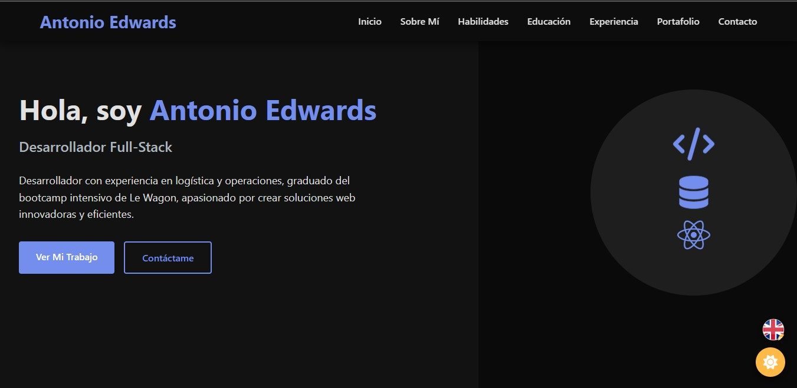

# Antonio Edwards - Portfolio Website



## Overview

Personal portfolio website showcasing my projects, skills and professional experience as a Full-Stack Developer.

## Features

- Responsive design that works on all devices
- Dark/light theme toggle
- Multilingual support (English/Spanish)
- Interactive portfolio with filtering capabilities
- Smooth animations and transitions
- Accessibility optimized

## Technologies Used

- HTML5, CSS3
- JavaScript (ES6+)
- CSS Custom Properties for theming
- Modular JS architecture
- IntersectionObserver for animations
- LocalStorage for user preferences

## Project Structure

```
portfolio/
│
├── assets/
│   ├── icons/
│   │   ├── spain-flag.ico
│   │   └── uk-flag.ico
│   └── images/
│       ├── airbnb-clone.jpg
│       ├── calories-tracker.jpg
│       ├── foot-finance.jpg
│       └── portfolio-screenshot.jpg
│
├── css/
│   └── main.css
│
├── src/
│   ├── animations.js     # Handles all site animations
│   ├── darkmode.js       # Controls dark mode functionality
│   ├── navigation.js     # Manages navigation and language switching
│   └── translations.js   # Contains translations for internationalization
│
├── index.html            # Main portfolio page
├── script.js             # Initializes all modules
└── README.md             # Project documentation
```

## Running Locally

1. Clone this repository
2. Open `index.html` in your browser
3. No build step needed - vanilla JS and CSS

## Performance Optimizations

- Lazy loading for off-screen images
- Modular JavaScript for better maintainability
- Optimized assets for fast loading

## Contact

Feel free to reach out if you have questions or want to connect:

- Email: Antonio.edwardsdev@gmail.com
- LinkedIn: [antonioedwardsd](https://www.linkedin.com/in/antonioedwardsd)
- GitHub: [antonioedwardsd](https://github.com/antonioedwardsd)
